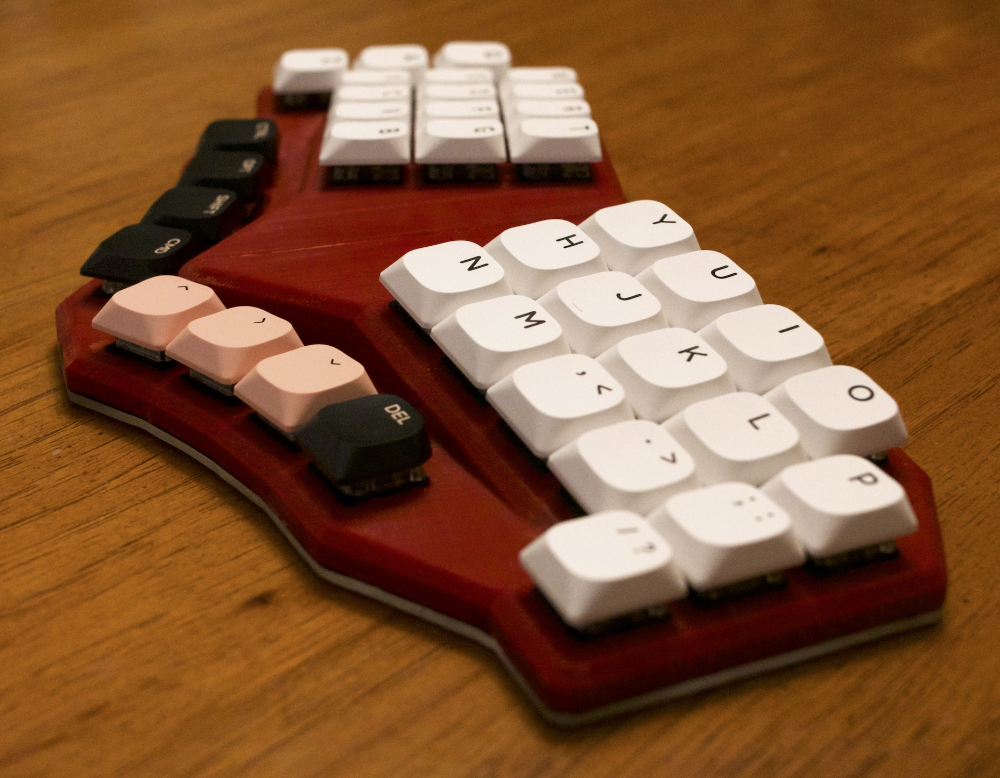

# Churn

Split unibody case for a handwired 40%-60% design. This started out from a set of designs I was churning through, thus the name. Waffling between having more splay and column stagger or tented ortho the vision for this board became clearer after [ScottoErgo](https://github.com/joe-scotto/scottokeebs/tree/main/ScottoErgo) and [Chrumm](https://github.com/sevmeyer/chrumm-keyboard/).

The design I built uses Gateron low-profile switches, a [nice!nano](https://nicekeyboards.com/nice-nano/), a [420mAh battery](https://www.adafruit.com/product/4236), plus wire and other components I had on hand.

## Pre-rendered designs

These STL files are split in half to be printed vertically. I printed mine at my public library with support material.

- [Churn 38-key](Churn.stl)
- [Churn 65-key](Churn-plus.stl)

Other options are possible by tweaking the OpenSCAD parameters such as splay, stagger, size, and if the board is split for printing.
